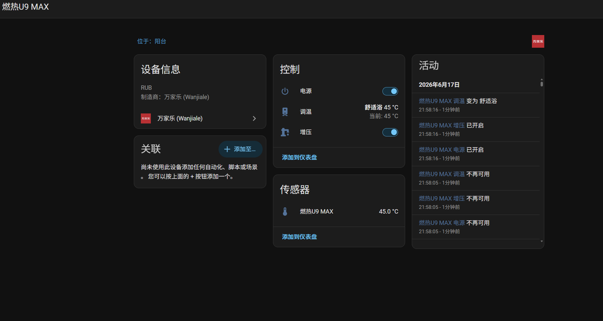
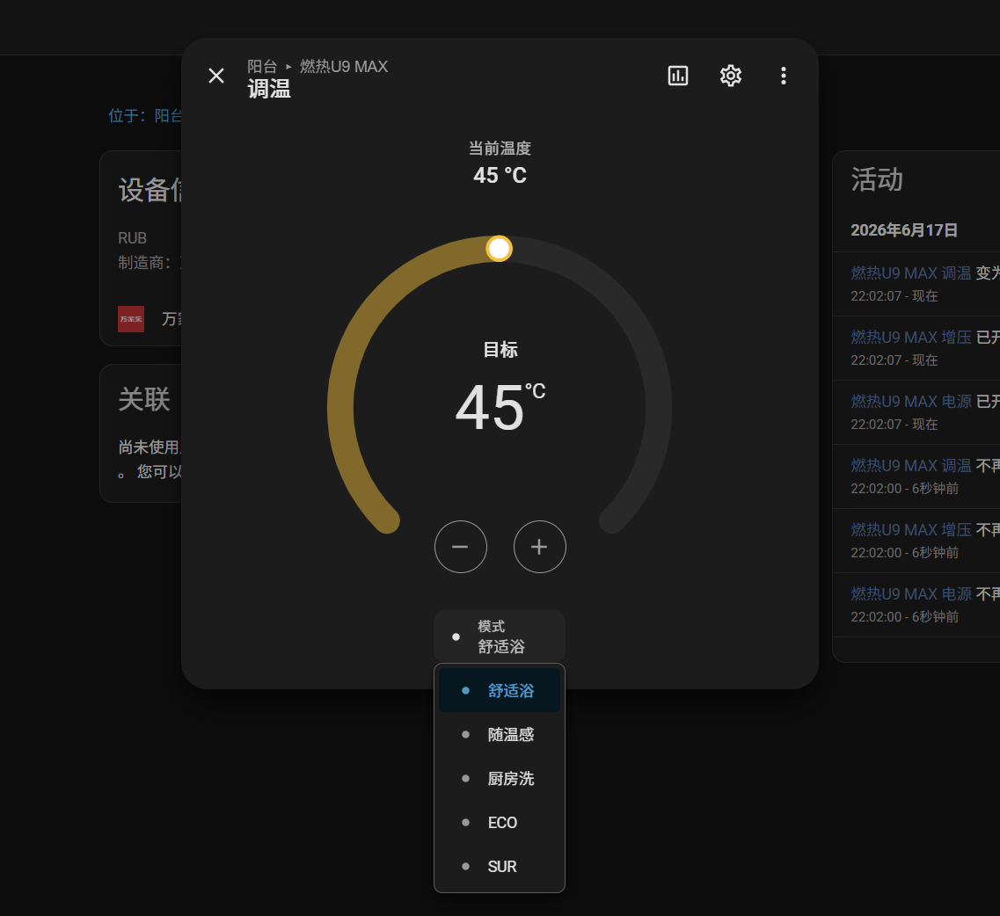

# Wanjiale Control

适用于 Home Assistant 的万家乐智能热水器集成。

## 功能截图

## 特性

- 局域网 + 云端双重控制（局域网控制有一定几率失败，每次控制可能会有2-5秒延迟）
- 基于燃热U9 MAX 热水器编写（我只有这台）
- 调温 / 模式切换 / 开关 / 增压

## FW3/BA5/DW3 专用说明

此分支已改为万家乐电热水器 FW3/BA5/DW3 专用 Home Assistant 集成。

已确认 DVID 映射：

- `101`：电源状态
- `102`：设置温度 / 调温写入
- `104`：当前热水量
- `105`：当前温度

当前刷新机制：默认每 10 秒刷新一次，优先云端长连接查询，失败后回退局域网查询。
